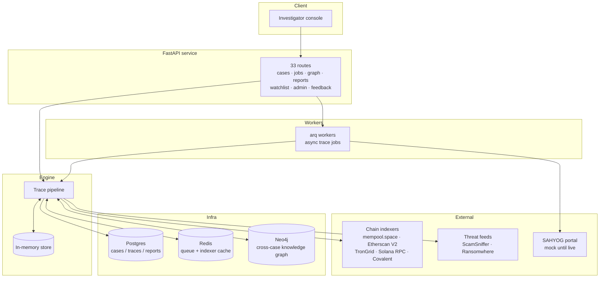

# VASP Attribution Engine

> **Automated attribution of unknown cryptocurrency wallets to the nearest legally-addressable VASP** — with calibrated confidence scoring, risk signals, live threat-intelligence matching, and court-ready evidentiary reports.

[](https://www.python.org/)
[](https://fastapi.tiangolo.com/)
[](#testing)
[](#api-reference)
[](#chain-support)
[](https://docs.astral.sh/uv/)

---

## Table of Contents

- [What it does](#what-it-does)
- [Key capabilities](#key-capabilities)
- [How it works](#how-it-works)
- [System architecture](#system-architecture)
- [Chain support](#chain-support)
- [API reference](#api-reference)
- [Attribution scoring](#attribution-scoring)
- [Threat intelligence](#threat-intelligence)
- [Legal routing](#legal-routing)
- [Quickstart](#quickstart)
- [Configuration](#configuration)
- [Testing](#testing)
- [Project structure](#project-structure)
- [Milestone history](#milestone-history)
- [Data integrity principles](#data-integrity-principles)
- [Security](#security)
- [License](#license)

---

## What it does

An investigator submits a suspect wallet address. The engine:

1. **Ingests** on-chain history across 5 blockchains via pluggable indexer adapters.
2. **Builds** a directed transaction graph (UTXO-aware bipartite expansion for Bitcoin).
3. **Classifies** every hop — peel chain, sweep, direct transfer, CoinJoin, mixer deposit, bridge lock, swap-service deposit.
4. **Traverses** toward the terminal entity using heuristic-guided BFS.
5. **Resolves** the terminal wallet to the nearest legally-addressable VASP from a curated, source-cited directory.
6. **Scores** the attribution with a calibrated confidence value and a 0–100 risk score.
7. **Delivers** a 13-section evidentiary report with a SHA-256 certificate, and routes the legal instrument (SAHYOG / MLAT / issuer freeze) for the jurisdiction.

Everything the engine claims is backed by an on-chain or source-cited reason string. Probabilistic leads (mixer correlation, CoinJoin) are explicitly labeled as such — never presented as attribution.

---

## Key capabilities

| Area | Capability |
|---|---|
| **Multi-chain tracing** | Bitcoin, Ethereum, BSC, Tron, Solana — one chain-agnostic pipeline |
| **Graph engine** | `networkx` MultiDiGraph; UTXO bipartite expansion; common-input clustering with CoinJoin guards |
| **Hop classification** | peel / sweep / direct + script-type matching; deterministic decoders for Uniswap V2/V3 & PancakeSwap swaps, Wormhole bridge calldata, EIP-1167/CREATE2 deposit proxies |
| **Terminal detection** | mixer deposits, CoinJoin, bridge locks, swap-service hot wallets, OTC/hawala collection patterns |
| **Cross-chain** | bridge calldata destination parsing + bounded destination-chain continuation traces |
| **Scoring** | per-hop confidence product with terminal adjustments; additive 0–100 risk signals |
| **VASP directory** | 32 curated records (FIU-IND registered domestic + offshore, non-compliant offshore, issuers) — every record cited and dated |
| **Threat intel** | ScamSniffer blacklist + Ransomwhere ransomware feed ingested, validated, and matched live |
| **Risk signals** | structuring/smurfing shapes (fan-out, fan-in, sub-threshold), sanctions proximity |
| **Legal routing** | SAHYOG/PMLA vs Egmont→MLAT vs issuer-freeze fast-track, with draft request templates |
| **Async at scale** | Redis job queue + arq workers; signed alert webhooks; watchlist with poller |
| **Knowledge graph** | Neo4j cross-case persistence — repeat addresses short-circuit with zero indexer calls |
| **Learning loop** | investigator outcome feedback recalibrates versioned scoring curves |
| **Performance** | durable Redis-backed indexer cache (auto / redis / memory / none) with TTL + LRU |

---

## How it works

```mermaid
flowchart LR
    A[Suspect address] --> B[Chain adapters]
    B --> C[TxGraph builder]
    C --> D[Hop classifier]
    D --> E[Traversal engine]
    E --> F{Terminal?}
    F -->|mixer / CoinJoin / bridge / swap-service / OTC / dead-end| G[VASP resolver]
    G --> H[Confidence × Risk scoring]
    H --> I[Threat-intel matching]
    I --> J[Report + SHA-256 certificate]
    J --> K[Legal instrument routing]
    K --> L[SAHYOG / MLAT / issuer freeze]
```



### Pipeline stages

| Stage | Module | What happens |
|---|---|---|
| **Ingest** | `engine/adapters/` | per-chain transaction, token-transfer, receipt and code fetching; `CachedChainAdapter` wraps every adapter (M25) |
| **Graph** | `engine/graph/` | `TxGraph` on `networkx` MultiDiGraph; Bitcoin UTXO bipartite expansion; `annotate_clusters` for CIOH |
| **Decode** | `engine/decoding/` | swap events (Uniswap V2/V3, PancakeSwap), Wormhole `transferTokens` calldata → (dest chain, recipient), EIP-1167 minimal proxies, CREATE2 address derivation (real Keccak-256) |
| **Classify** | `engine/classifier/` | peel / sweep / direct with script-type match factor; deterministic decoders run before heuristics so CoinJoins are never misread as custodial sweeps |
| **Traverse** | `engine/traversal/` | heuristic BFS — peel follows the change branch first; sweep stops at consolidation with retroactive back-labeling |
| **Correlate** | `engine/intel/` | mixer withdrawal ranking (timing decay + anonymity-set context + gas-funding self-link), structuring shapes, OTC collection patterns, threat-feed hits |
| **Resolve** | `engine/vasp/` | terminal → nearest legally-addressable VASP from the curated directory |
| **Score** | `engine/scoring/` | confidence product-over-hops; additive risk signals |
| **Report** | `engine/report/` | 13-section report + SHA-256 evidentiary certificate (BSA §63) |
| **Deliver** | `engine/delivery/` | signed webhooks to SAHYOG (mock until real API access) and watch-alert consumers |

---

## System architecture



Every stateful backend degrades gracefully: `STORE_BACKEND` / `QUEUE_BACKEND` / `INDEXER_CACHE_BACKEND` all support `auto` (try durable, sticky-fallback to in-memory) so the engine runs with zero infrastructure for development.

---

## Chain support

| Chain | Adapter | Indexer | Notes |
|---|---|---|---|
| Bitcoin | `bitcoin.py` | mempool.space (free, no key) | Blockchair keyless returns HTTP 430 from shared egress — not used |
| Ethereum | `evm.py` | Etherscan V2 | full calldata retained for bridge-counterparty txs |
| BSC | `evm.py` | public BSC RPC | PancakeSwap V2 + Smart Router decoding |
| Tron | `tron.py` | TronGrid | |
| Solana | `solana.py` | public JSON-RPC | SPL token-account owner resolution |

> **Key rotation:** Etherscan V2 serves EVM chains; Covalent is available as an additional source. The free-tier Solscan key 401s on Pro v2.0 endpoints by design, so Solana runs on the public RPC.

---

## API reference

**33 routes** — 27 engine routes + 6 mock-SAHYOG routes. Interactive docs at `http://localhost:8000/docs`.

### Health

| Method | Path | Description |
|---|---|---|
| GET | `/health` | liveness probe |
| GET | `/ready` | readiness probe (dependency checks) |

### Cases

| Method | Path | Description |
|---|---|---|
| POST | `/cases` | open a new investigation case |
| GET | `/cases/{case_id}` | fetch case detail |

### Jobs (async tracing)

| Method | Path | Description |
|---|---|---|
| POST | `/jobs/trace` | submit a trace job → `202` + `job_id` (Redis/arq worker) |
| GET | `/jobs/{job_id}` | poll job status and result |

### Graph & topology

| Method | Path | Description |
|---|---|---|
| GET | `/cases/{case_id}/graph` | full transaction graph for a case |
| GET | `/cases/{case_id}/graph/path` | attributed path: subject → terminal → VASP |
| GET | `/cases/{case_id}/graph/stats` | node/edge/hop-kind statistics |
| GET | `/cases/{case_id}/links` | cross-case intelligence links (Neo4j) |
| GET | `/intel/infrastructure/{tag}` | infrastructure tag lookup (e.g. OTC-terminus registry tags) |

### Reports

| Method | Path | Description |
|---|---|---|
| GET | `/reports/{report_id}` | 13-section evidentiary report + SHA-256 certificate |

### Watchlist

| Method | Path | Description |
|---|---|---|
| POST | `/watchlist` | add a watch entry |
| GET | `/watchlist` | list watch entries |
| GET | `/watchlist/{watch_id}` | watch entry detail |
| PATCH | `/watchlist/{watch_id}` | update a watch entry |
| DELETE | `/watchlist/{watch_id}` | remove a watch entry |
| GET | `/watchlist/{watch_id}/alerts` | alerts raised for an entry |
| POST | `/watchlist/{watch_id}/check` | trigger an immediate check (signed webhook on hit) |

### Admin (RBAC-gated)

| Method | Path | Description |
|---|---|---|
| POST | `/admin/users` | create user |
| GET | `/admin/users` | list users |
| DELETE | `/admin/users/{user_id}` | delete user |
| GET | `/admin/audit` | immutable audit log |

### Feedback (scoring calibration loop)

| Method | Path | Description |
|---|---|---|
| POST | `/feedback/outcomes` | record an investigator's ground-truth outcome |
| GET | `/feedback/outcomes` | list recorded outcomes |
| POST | `/feedback/recalibrate` | recalibrate versioned scoring curves |
| GET | `/feedback/calibration` | inspect current calibration curves |

### Mock SAHYOG (`integrations/sahyog_mock` — until real portal access)

| Method | Path | Description |
|---|---|---|
| POST | `/sahyog/cases` | mock case submission |
| GET | `/sahyog/cases/{case_id}` | mock case status |
| POST | `/sahyog/webhook/attribution` | engine → portal attribution delivery |
| GET | `/sahyog/webhooks` | mock inbox (inspect delivered payloads) |
| POST | `/sahyog/webhook/watch-alert` | engine → portal watch alert |
| GET | `/sahyog/watch-alerts` | mock watch-alert inbox |

---

## Attribution scoring

### Confidence

The confidence of an attribution is the **product over hops** of
`(classifier confidence × hop-kind discount)`, with terminal adjustments:

| Terminal | Discount / adjustment |
|---|---|
| sweep consolidation | 0.80 floor |
| swap-service deposit | 0.60 |
| CoinJoin | 0.50 (denominations stay visible) |
| mixer deposit | 0.40 |
| bridge lock | 0.85 → 0.95 when the destination is parsed from calldata |

Deterministic decoders always run before heuristics, and every factor carries a human-readable reason string. The feedback loop (M13) recalibrates the curves from recorded investigator outcomes.

### Risk (0–100, additive)

| Signal | Points |
|---|---|
| ransomware direct hit (Ransomwhere) | +40 |
| mixer-deposit terminal / CoinJoin terminal | +40 |
| OTC/hawala terminus | +30 |
| scam direct hit (ScamSniffer) | +25 |
| swap-service terminal | +25 |
| bridge terminal | +15 |
| structuring: fan-out / fan-in burst | +15 |
| peel chain | +10 |
| structuring: sub-threshold cluster | +10 |
| unregistered terminal VASP | +10 |

Sanctions-proximity scoring is designed and deferred.

---

## Threat intelligence

Two live-verified public feeds, ingested by `scripts/refresh_threat_feeds.py` into dated, gitignored snapshots under `data/threat_feeds/` with strict shape validation (unknown shapes fail loudly; malformed entries are counted as skipped):

| Feed | Records | What it is |
|---|---|---|
| ScamSniffer `scam-database` (`blacklist/all.json`) | 4,599 EVM addresses | scam / phishing / drainer blacklist — the **live** file (`blacklist/address.json` is frozen since 2024-02-28 and is never used) |
| Ransomwhere (`api.ransomwhe.re/export`) | 11,186 BTC records | ransomware-payment records with family labels (crowdsourced — every reason string carries the caveat) |

Direct-path hits become `TraceResult.threat_hits` and feed the risk scorer. Every record carries its source URL; fixtures use 24 real extracted entries with provenance.

---

## Legal routing

`engine/vasp/routing.py` selects the instrument by jurisdiction and entity type:

| Situation | Instrument |
|---|---|
| Domestic / FIU-IND-registered VASP | **SAHYOG / PMLA** request |
| Offshore, non-compliant VASP | **Egmont → MLAT** channel |
| Stablecoin issuer (Tether / Circle) | **Issuer-freeze fast-track** |

Draft request templates are generated per route. The VASP directory holds 32 records — 10 domestic + 5 offshore FIU-IND-registered, 15 PIB 09-SEP-2026 non-compliant offshore, plus Tether/Circle issuers — each with named source and date; `travel_rule` is honestly marked `unknown` where unverified.

---

## Quickstart

### With Docker (full stack)

```bash
cp .env.example .env   # fill in indexer API keys — never commit .env
docker compose up -d   # postgres, redis, neo4j, api, worker, sahyog-mock
# API:           http://localhost:8000/docs
# Mock SAHYOG:   http://localhost:8091
```

Async trace flow:

```bash
# 1. open a case
curl -X POST http://localhost:8000/cases -H 'Content-Type: application/json' \
  -d '{"subject_address": "0x…", "chain": "ethereum"}'

# 2. start a trace  →  202 + job_id
curl -X POST http://localhost:8000/jobs/trace -H 'Content-Type: application/json' \
  -d '{"case_id": "<id>", "address": "0x…", "chain": "ethereum"}'

# 3. poll status
curl http://localhost:8000/jobs/<job_id>

# 4. read the evidentiary report
curl http://localhost:8000/reports/<report_id>

# 5. inspect what the worker delivered to the (mock) portal
curl http://localhost:8091/sahyog/webhooks
```

> Neo4j needs ~2 minutes cold boot on a fresh volume.

### Local dev (no Docker)

The API and worker fall back to in-memory store/queue automatically:

```bash
uv sync --extra dev
uv run uvicorn api.main:app --reload   # http://localhost:8000/docs
# or drive the mock portal directly:
uv run python integrations/sahyog_mock/submit_case.py <address> <chain>
```

---

## Configuration

All settings follow **`.env` → declared default** precedence (never the reverse). Copy `.env.example` to `.env`:

| Variable | Default | Purpose |
|---|---|---|
| `ETHERSCAN_API_KEY` | — | Etherscan V2 (EVM indexers) |
| `TRONGRID_API_KEY` | — | TronGrid |
| `SOLSCAN_API_KEY` | — | Solscan (free tier; Solana itself uses public RPC) |
| `COVALENT_API_KEY` | — | Covalent |
| `POSTGRES_DSN` | compose default | Postgres persistence |
| `NEO4J_URI` / `NEO4J_USER` / `NEO4J_PASSWORD` | compose default | knowledge graph |
| `REDIS_URL` | compose default | queue + durable cache |
| `SAHYOG_MOCK_URL` | `http://localhost:8091` | portal endpoint |
| `ENGINE_WEBHOOK_SECRET` | — | signs outbound webhooks |
| `STORE_BACKEND` | `auto` | `auto` \| `postgres` \| `memory` |
| `QUEUE_BACKEND` | `auto` | `auto` \| `redis` \| `memory` |
| `INDEXER_CACHE_BACKEND` | `auto` | `auto` \| `redis` \| `memory` \| `none` |
| `INDEXER_CACHE_TTL` | `3600` | seconds a cached indexer response is served |
| `INDEXER_CACHE_MAX_ENTRIES` | `10000` | memory-backend LRU cap |
| `INDEXER_CACHE_PREFIX` | `vasp:idx:v1` | Redis key prefix |
| `SANCTIONS_TABLE_PATH` | empty | full OFAC SDN Advanced XML; empty = vendored fixture sample |
| `WATCH_POLL_MINUTES` | `15` | watchlist poller cadence |
| `AUTH_ENFORCED` | `false` | `true` = require `X-API-Key` on protected routes |

---

## Testing

**265 unit tests + live regression**, all green:

```bash
uv run pytest tests/ -q            # 265 unit tests (synthetic + fixtures)
uv run python scripts/regression.py --live   # bounded live-network regression
```

- Per-milestone suites: `tests/test_m3.py` … `tests/test_m25.py`
- Live smoke scripts: `scripts/smoke_m3.py` … `scripts/smoke_m25.py` (bounded, skip cleanly without keys/infra)
- `scripts/refresh_threat_feeds.py` re-fetches and validates threat intel snapshots

---

## Project structure

```
├── api/                    # FastAPI service
│   ├── main.py             # app wiring — 33 routes
│   ├── core/               # auth, audit, config, logging
│   └── routers/            # health, cases, jobs, graph, reports, watchlist, admin, feedback
├── engine/                 # chain-agnostic tracing engine
│   ├── adapters/           # bitcoin / evm / tron / solana / covalent (+ base)
│   ├── indexer/            # CachedChainAdapter — durable indexer cache (M25)
│   ├── graph/              # TxGraph (networkx MultiDiGraph), UTXO expansion
│   ├── decoding/           # swaps, bridge calldata, CREATE2/EIP-1167 proxies
│   ├── classifier/         # hop classifier (peel/sweep/direct/coinjoin/swap-service)
│   ├── clustering/         # common-input clustering with CoinJoin guards
│   ├── traversal/          # heuristic BFS traversal engine
│   ├── knowledge/          # curated registries: mixers, bridges, dex, swap services, proxies
│   ├── intel/              # threat feeds, mixer correlation, structuring, OTC, sanctions, cross-case
│   ├── vasp/               # VASP directory + legal-instrument routing
│   ├── scoring/            # confidence + risk
│   ├── report/             # 13-section report + SHA-256 certificate
│   ├── store/              # postgres / memory / neo4j persistence + migrations
│   ├── watch/              # watchlist engine + signed alert webhooks
│   ├── feedback/           # outcome feedback + calibration curves
│   ├── jobs/               # async pipeline + queue
│   ├── delivery/           # webhook delivery
│   └── auth/               # API-key auth, RBAC
├── worker/                 # arq background workers
├── vasp_directory/         # FIU-IND seed data
├── reports/                # report artifacts
├── integrations/
│   └── sahyog_mock/        # mock SAHYOG portal (until real API access)
├── scripts/                # smoke_*, regression.py, refresh_threat_feeds.py
├── tests/                  # 265 unit tests
├── docs/                   # ARCHITECTURE.md, API.md
├── docker-compose.yml      # postgres, redis, neo4j, api, worker, sahyog-mock
├── Dockerfile
└── pyproject.toml          # uv-managed; requires-python >= 3.11
```

---

## Milestone history

| # | Milestone |
|---|---|
| M0 | Project scaffold |
| M1 | EVM + Tron adapters |
| M2 | Bitcoin + Solana adapters (mempool.space / public Solana RPC) |
| M3 | Graph construction, hop classifier, traversal engine |
| M4 | DEX decoding, bridge correlation, mixer detection, SPL owner resolution |
| M5 | VASP directory seed (32 records) + legal-instrument routing |
| M6 | Confidence + risk scoring, report + SHA-256 evidentiary certificate |
| M7 | Async jobs (Redis/arq), Postgres persistence, SAHYOG webhooks |
| M8 | Neo4j cross-case knowledge graph (in-memory fallback) |
| M9 | Cross-case intelligence + certified syndicate briefs |
| M10 | Watchlist + signed alert webhooks |
| M11 | Topology / visualization API |
| M12 | RBAC + audit log, hashed API keys, jurisdiction scoping |
| M13 | Feedback loop with versioned calibration curves |
| M14 | Script-type match as third peel-classifier factor |
| M15 | PancakeSwap V2/V3 decoder integration |
| M16 | CREATE2 deposit-proxy detection (real Keccak-256) |
| M17 | Common-input clustering with structural CoinJoin guards |
| M18 | Swap-service hot-wallet registry (12 on-chain-verified addresses) |
| M19 | OTC/hawala terminus detection + persistent registry |
| M20 | CoinJoin as a traversal terminal |
| M21 | Bridge calldata destination parsing + destination-chain continuation |
| M22 | Mixer correlation heuristics (probabilistic leads only) |
| M23 | Structuring / smurfing risk signals |
| M24 | ScamSniffer + Ransomwhere threat-feed ingestion |
| M25 | Durable Redis-backed indexer cache |

---

## Data integrity principles

- **Every curated address is named-sourced and ideally on-chain verified.** The commonly quoted Tornado `deposit()`/`withdraw()` selectors match nothing on-chain — the real selectors (`0xb214faa5` / `0x21a0adb6`) were verified empirically across all four pools before use.
- **No fabricated data.** Where no public source exists (e.g. OTC registry seed, Exolix/StealthEX labels), the engine refuses to invent one and says so.
- **Probabilistic is labeled probabilistic.** Mixer correlation and CoinJoin analysis produce ranked leads with explicit "not attribution" framing; terminal discounts stay applied.
- **Feeds are live-verified**, shape-validated, and every record carries its source URL and fetch date.

---

## Security

- Hashed API keys (`X-API-Key`), RBAC with jurisdiction scoping (M12)
- Immutable audit log (`GET /admin/audit`)
- Outbound webhooks HMAC-signed with `ENGINE_WEBHOOK_SECRET`
- `.env` is gitignored and never committed; bundles never contain credentials

---

## License

License terms are not yet finalized. All rights reserved unless otherwise agreed.
